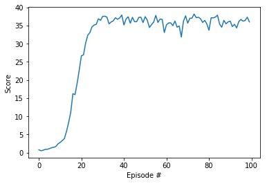

# Report: Project2-Continuous-Control

### Learning Algorithm

This notebook implemented DDPG algorithm (https://arxiv.org/abs/1509.02971).

Recall the DQN algorithm, the main problems of having a continuous action space is how to compute ). We may use some discretization methods, but the discrete space will then be very huge and almost impossible to compute. In order to solve this, Deep Deterministic Policy Gradient (DDPG) (https://arxiv.org/abs/1509.02971) uses a separate network to approximate it:
\approx\max_aQ_{\phi}(s,a))

We can think it as a "deterministic" actor-critic algorithm, because we have two networks: one for the actor (policy), ![actor], another for the critic (action value function), ![critic]. Note that the actor network is mainly used to approximate the maximum value of action value function given a state, not the action probability distribution ![policy] usually used in other actor-critic or policy gradient algorithms (with discrete action space). We can select action according to the actor network, but since it's deterministic, we'd better to add extra noise to consider exploration. In this implement, we consider Ornstein-Uhlenbeck process.

The input dimension of actor network, ![actor], equals to the state space dimension, and the output dimension of it equals to the action space dimension (output continuous values, do not need softmax). The input dimension of critic network, ![critic], equals to state space dimension plus action space dimension, while its output layer has only one neuron! This is different from DQN where input dimension equals to state space dimension and output dimension equals to action space dimension. Details of networks are shown below:

```python
class Actor(nn.Module):
    def __init__(self, state_size, action_size, fc_units=256):
        super(Actor, self).__init__()
        self.fc1 = nn.Linear(state_size, fc_units)
        self.fc2 = nn.Linear(fc_units, action_size)
        self.reset_parameters()

    def reset_parameters(self):
        self.fc1.weight.data.uniform_(*hidden_init(self.fc1))
        self.fc2.weight.data.uniform_(-3e-3, 3e-3)

    def forward(self, state):
        x = F.relu(self.fc1(state))
        return F.tanh(self.fc2(x))


class Critic(nn.Module):
    def __init__(self, state_size, action_size, fcs1_units=256, fc2_units=256, fc3_units=128):
        super(Critic, self).__init__()
        self.fcs1 = nn.Linear(state_size, fcs1_units)
        self.fc2 = nn.Linear(fcs1_units+action_size, fc2_units)
        self.fc3 = nn.Linear(fc2_units, fc3_units)
        self.fc4 = nn.Linear(fc3_units, 1)
        self.reset_parameters()

    def reset_parameters(self):
        self.fcs1.weight.data.uniform_(*hidden_init(self.fcs1))
        self.fc2.weight.data.uniform_(*hidden_init(self.fc2))
        self.fc3.weight.data.uniform_(*hidden_init(self.fc3))
        self.fc4.weight.data.uniform_(-3e-3, 3e-3)

    def forward(self, state, action):
        xs = F.leaky_relu(self.fcs1(state))
        x = torch.cat((xs, action), dim=1)
        x = F.leaky_relu(self.fc2(x))
        x = F.leaky_relu(self.fc3(x))
        return self.fc4(x)
```

More details can be found in  (https://spinningup.openai.com/en/latest/algorithms/ddpg.html) algotithm to solve this continuous control problem. Two networks are utilized: one for actor and one for critic. The uniform weights inilization helps the training to converge faster.

The hyperparameters used for training:
- BUFFER_SIZE = int(1e5)  # replay buffer size
- BATCH_SIZE = 128        # minibatch size
- GAMMA = 0.99            # discount factor
- TAU = 0.999             # for soft update of target parameters
`target_param.data.copy_(tau*target_param.data + (1.0-tau)*param.data)`
- LR_ACTOR = 5e-4         # learning rate of the actor
- LR_CRITIC = 5e-4        # learning rate of the critic
- WEIGHT_DECAY = 0.0      # L2 weight decay
- EPSILON = 1.0           # explore->exploit noise process added to act step
- EPSILON_DECAY = 0.99    # decay rate for noise process
- UPDATE_EVERY = 1        # how often to update the target network
- LEARN_NUM = 1

This algorithm is off policy. So we initialize a replay buffer to store the tuples collected at each step and reuse them for training.

The agent class stores two set of networks: critic and actor networks for training; a copy of them (actor_target, critic_target) to compute the loss (avoid the moving target). The weights of target networks are soft updated at every step.

The expected outputs of this implement are:
- critic network weights: `checkpoint_critic.pth`
- actor network weights: `checkpoint_actor.pth`

### Plot of rewards


### Ideas for Future Work
- implement Proximal Policy Optimization (PPO) for better performance
- try prioritized experience replay
- try N-step returns
- try different agents: D4PG, TD3, SAC, PlanNet and Dreamer.


[actor]:http://chart.apis.google.com/chart?cht=tx&chl=\mu_{\theta}
[critic]:http://chart.apis.google.com/chart?cht=tx&chl=Q_{\phi}(s,a)
[policy]:http://chart.apis.google.com/chart?cht=tx&chl=\pi(a|s)
