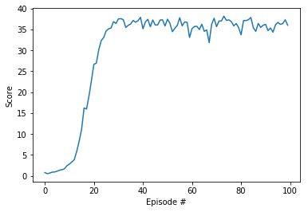

# Report: Project2-Continuous-Control

### Learning Algorithm

Follow the instructions in `Continuous_Control.ipynb` to get started with training your own agent! 

This work implemented DDPG (https://spinningup.openai.com/en/latest/algorithms/ddpg.html) algotithm to solve this continuous control problem. Two networks are utilized: one for actor and one for critic. The uniform weights inilization helps the training to converge faster.

The hyperparameters used for training:
- BUFFER_SIZE = int(1e5)  # replay buffer size
- BATCH_SIZE = 128        # minibatch size
- GAMMA = 0.99            # discount factor
- TAU = 0.999             # for soft update of target parameters
`target_param.data.copy_(tau*target_param.data + (1.0-tau)*param.data)`
- LR_ACTOR = 5e-4         # learning rate of the actor
- LR_CRITIC = 5e-4        # learning rate of the critic
- WEIGHT_DECAY = 0.0      # L2 weight decay
- EPSILON = 1.0           # explore->exploit noise process added to act step
- EPSILON_DECAY = 0.99    # decay rate for noise process
- UPDATE_EVERY = 1        # how often to update the target network
- LEARN_NUM = 1

Because the actor (policy) network is deterministic. To consider exploitation in the training Ornstein-Uhlenbeck process is used for adding noise

This algorith is off policy. So we initialize a replay buffer to store the tuples collected at each step and reuse them for training.

The agent class stores two set of networks: critic and actor networks for training; a copy of them (actor_target, critic_target) to compute the loss (avoid the moving target). The weights of target networks are soft updated at every step.

The expected outputs of this implement are:
- critic network weights: `checkpoint_critic.pth`
- actor network weights: `checkpoint_actor.pth`

### Plot of rewards


### Ideas for Future Work
- implement Proximal Policy Optimization (PPO) for better performance
- try prioritized experience replay
- try N-step returns
- try different agents: D4PG, TD3, SAC, PlanNet and Dreamer.


Recall the DQN algorithm, the main problems of having a continuous action space is 
- how to select $a_t$ according to $$\epsilon\mbox{-Greedy}(Q_{\phi})$$?
- how to compute $$y_j =  r(s_j,a_j)+\gamma\max_{a_{j+1}}Q_{\phi'}(s_{j+1},a_{j+1})$$?

The key problem is to compute $`\max_aQ_{\phi}(s,a)`$. To solve this, Deep Deterministic Policy Gradient (DDPG) (https://arxiv.org/abs/1509.02971) uses a separate network to approximate it:
```latex
    \mu_{\theta}(s)\approx\max_aQ_{\phi}(s,a)
```
We can think is as a "deterministic" actor-critic algorithm, because we have two networks: one for the actor (policy), $`\mu_{\theta}`$, another for the critic (action value function), $`Q_{\phi}(s,a)`$. But the actor network is mainly used to approximate $`\max_aQ_{\phi}(s,a)`$ not $`\pi(a|s)`$ used in other actor-critic or policy gradient algorithms. We can select action according to the actor network, but it's deterministic and we need to add extra noise to consider exploration.

The input dimension of actor network, $`\mu_{\theta}`$, equals to the state space dimension, and the output dimension of it equals to the action space dimension (output continuous values, do not need softmax). The input dimension of critic network, $`Q_{\phi}`$, equals to state space dimension plus action space dimension, while its output layer has only one neuron! This is different from DQN where input dimension equals to state space dimension and output dimension equals to action space dimension.

The final question is how to update $\theta$. Because want to maximize $`Q_{\phi}(s,\mu_{\theta}(s))`$, so update $\theta$ by gradient ascent with $`\nabla_{\theta}Q_{\phi}(s,\mu_{\theta}(s))=\nabla_aQ(s,a)\nabla_{\theta}\mu_{\theta}(s)`$. Think it like a policy based algorithm, we want to maximize the expected return.


